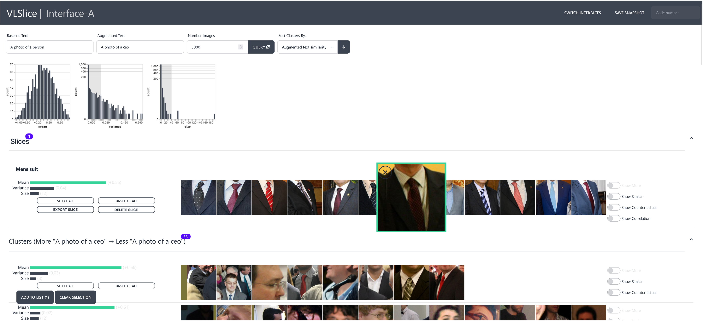

# VLSlice


VLSlice is an interactive system enabling user-guided discovery of Vision-Language Slices, coherent representation-level subgroups with consistent visiolinguistic behavior, from unlabeled image sets. Slices can help identify problematic behaviors and biases learned by web-scale pretrained models. VLSlice supports users in discovering and refining slices along arbitrary bias dimensions while leveraging those slices to assist them in validating model behavior.


[**[ pdf ]**](https://arxiv.org/abs/2309.06703)
[**[ poster ]**](https://ericslyman.com/assets/pdf/vlslice_poster.pdf)
[**[ iccv talk ]**](https://drive.google.com/file/d/1mOuvjphNb2xNDC7shoGbPwyjbfArwud4/view?usp=drive_link)
[**[ showcase talk ]**](https://www.youtube.com/watch?v=2CMDcGGsMjo&list=PLUxOP3kBxs2JYA5KT0YEmNJEyjqAqLOf3&index=1)
[**[ video demo ]**](https://drive.google.com/file/d/1JkbVXnCds6rOErUx-YWZmp3mQ3IDJuhi/view?usp=drive_link)
[**[ website ]**](https://ericslyman.com/vlslice/)

## Getting Started

The VLSlice client is built with a JS/Svelte client running on a Python/Flask backend. To run the server, however, only the Python dependencies must be installed. The following code blocks walk through downloading precomputed image embeddings from CLIP on OpenImages, creating an appropriate Python environment with conda, and starting the VLSlice server.

There are two options for downloading data. The "dev" embeddings contain the first million examples and are much smaller. Those with slow internet or less than 16GB of RAM should consider this version. The "all" embeddings use all 8 million examples and require >16GB RAM to load.

```bash
# 1. Download Data

# ~2GB, loads into RAM quickly.
# Labels are used for pre-filtering OpenImages as described in Section 4.1.
wget https://d30mxw38m32j53.cloudfront.net/embeddings/imgs_dev.npy -O vlslice/server/data/imgs.npy
wget https://d30mxw38m32j53.cloudfront.net/embeddings/lbls_dev.npy -O vlslice/server/data/lbls.npy
wget https://d30mxw38m32j53.cloudfront.net/embeddings/embs_dev.npy -O vlslice/server/data/embs.npy

# ~16GB, can take some time to load, even with enough RAM.
# Labels are used for pre-filtering OpenImages as described in Section 4.1.
wget https://d30mxw38m32j53.cloudfront.net/embeddings/imgs_all.npy -O vlslice/server/data/imgs.npy
wget https://d30mxw38m32j53.cloudfront.net/embeddings/lbls_all.npy -O vlslice/server/data/lbls.npy
wget https://d30mxw38m32j53.cloudfront.net/embeddings/embs_all.npy -O vlslice/server/data/embs.npy

# 2. Install Python dependencies with Conda
conda env create -f environment.yml
conda activate vlslice

# If using an Intel CPU, sklearn intelex can speed up clustering (optional)
conda install scikit-learn-intelex=2021.4.0

# 3. Run the server: http://127.0.0.1:5000
cd vlslice/server
python server.py
```

The server should now be running locally and can be accessed at [http://127.0.0.1:5000](http://127.0.0.1:5000).

## Configuration

Our code can be used with any ViL model that separately embeds images and text, and any image dataset. All that is required is an array of precomputed image embeddings, image URLs, and modifying the forward pass in [model.py](vlslice/server/model.py) to use your model.

### Configuring Flask

All properties set under `flask` in the [config.yml](vlslice/server/config.yml) are automatically passed as a dictionary unpacked into the flask `app.run()` call. Set whichever settings you wish for flask to use here.

### Using Your Own Data

To configure your own data, specify three numpy files in the [config.yml](vlslice/server/config.yml):

```yaml
data:
  # ndarray[string] (N) containing N image paths. 
  # e.g., "https://d30mxw38m32j53.cloudfront.net/00000000.jpg"
  imgs_npy: ./data/imgs.npy  
  
  # ndarray[string] (N) containing N image classes. 
  # Set to "null" to disable filtering.
  lbls_npy: ./data/lbls.npy  

  # ndarray[float] (NxD) containing N image embeddings of size D.
  embs_npy: ./data/embs.npy  
```

VLSlice will use these files to load, filtering, and cluster your images. All files are expected to share the same index order. If you wish to exclude any class of images from display in VLSlice (e.g., to remove redundant subparts of people), then the target class to be removed may be specified under `exclude_classes`.

### Using Your Own Model

To configure your own model, specify the `name` and `configuration` of the model under the [config.yml](vlslice/server/config.yml):

```yaml
data:
  # Name of the model to load
  name: hf_clip

  # Configuration options to pass to model initialization
  config:
    version: openai/clip-vit-base-patch16
    device: cpu
```

You may add your own model by extending the base [VLSliceModel](vlslice/server/models/base.py) class and adding a corresponding model name to the [model registry](vlslice/server/models/__init__.py). Properties under `config` will automatically be passed to your model during initialization. For an example, see [HFCLIP.py](vlslice/server/models/HFCLIP.py), where we register a HuggingFace CLIP model.

```python
class VLSliceModel(ABC, torch.nn.Module):

    @classmethod
    @abstractmethod
    def similarity(cls, txt_embs: ArrayLike, img_embs: ArrayLike) -> ArrayLike:
        """Calculate text-image similarity scores normalized to the range [0, 1].

        Args:
            txt_embs (ArrayLike): N_t text embeddings.
            img_embs (ArrayLike): N_i image embeddings.

        Returns:
            ArrayLike: N_t x N_i similarity scores.
        """
        pass

    @abstractmethod
    def forward(self, txt: list[str]) -> ArrayLike:
        """Extract text embeddings.

        Args:
            txt (list[str]): List of N strings to embed.

        Returns:
            ArrayLike: Outputted NxD text embeddings.
        """
        pass
```

**Note that the model used in VLSlice should be the same model used to extract `embs_img.npy`.**

## Development

To develop the client interface, first install npm and Node.js. Then, run the following commands after making edits to the interface. No special setup is required beyond installing the conda environment to develop the server.

```bash
# Install packages
cd vlslice/client
npm install

# Choose one...
# Build once.
npm run build

# Build and check for updates.
npm run autobuild
```

## Troubleshooting

Tokenizers may fail to install on Apple Silicon machines due to the rust compiler missing. The compiler can be installed with the following command:

```bash
curl --proto '=https' --tlsv1.2 -sSf https://sh.rustup.rs | sh
source "$HOME/.cargo/env"
```

Then install the environment with Conda as described above. Conda and Pip can take some time with this installation.

## Citation

```bibtex
@article{slyman23vlslice,
  author = {Slyman, Eric and Kahng, Minsuk and Lee, Stefan},
  journal = {International Conference on Computer Vision (ICCV)},
  month = oct,
  title = {{VLSlice: Interactive Vision-and-Language Slice Discovery}},
  year = {2023}
}
```
